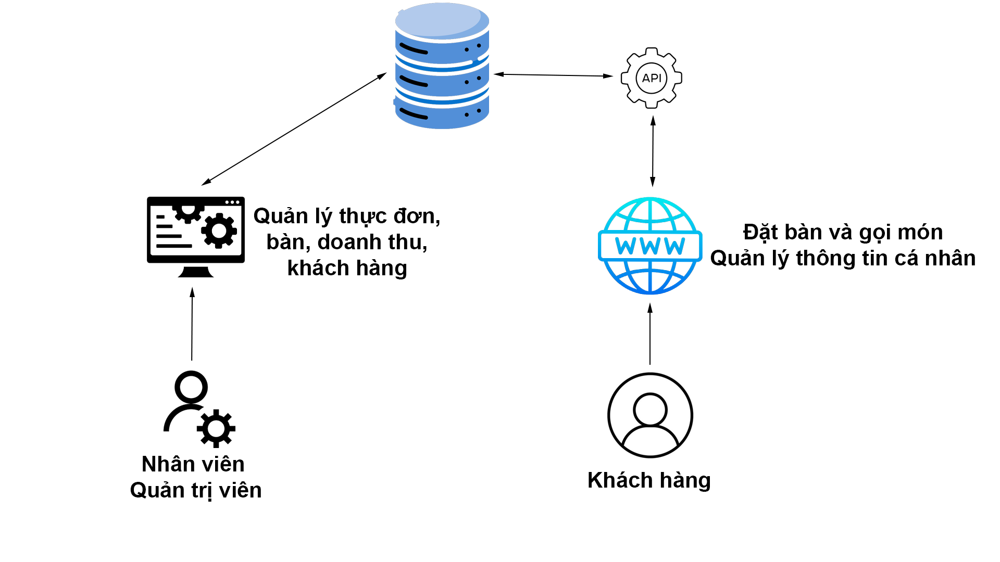

<h3>Thành viên</h3>
<table>
  <tr>
    <th>STT</th>
    <th>Họ tên</th>
    <th>Chức vụ</th>
  </tr>
  <tr>
    <td>1</td>
    <td>Nguyễn Đức Hiền</td>
    <td>Nhóm trưởng</td>
  </tr>
  <tr>
    <td>2</td>
    <td>Huỳnh Quang Khiêm</td>
    <td>Thành viên</td>
  </tr>
</table>

<h3>Sử dụng</h3>
<ul>
  <li>.NET Framework version 4.8</li>
  <li>Visual studio 2022</li>
</ul>

<h3>Chi tiết</h3>

<h3>Dự án</h3>

<h4>Hệ thống quản lý nhà hàng</h4>

<h6>Mô tả dự án</h6>
Xây dựng hệ thống Quản lý Nhà Hàng một cách chuyên nghiệp, linh hoạt, có thể quản lý và lưu trữ được một lượng dữ liệu lớn. Hệ thống giúp người dùng dễ dàng hơn trong việc tổ chức, quản lý dữ liệu Khách hàng, quản lý Đặt bàn, quản lý Thực đơn,… và nhiều hơn thế nữa.
 
<h4>Yêu cầu</h4>
AI: Dự đoán doanh thu
Web: Spring MVC
